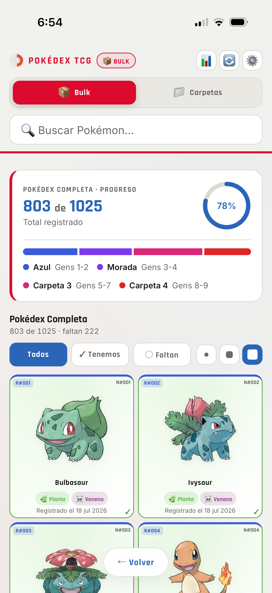
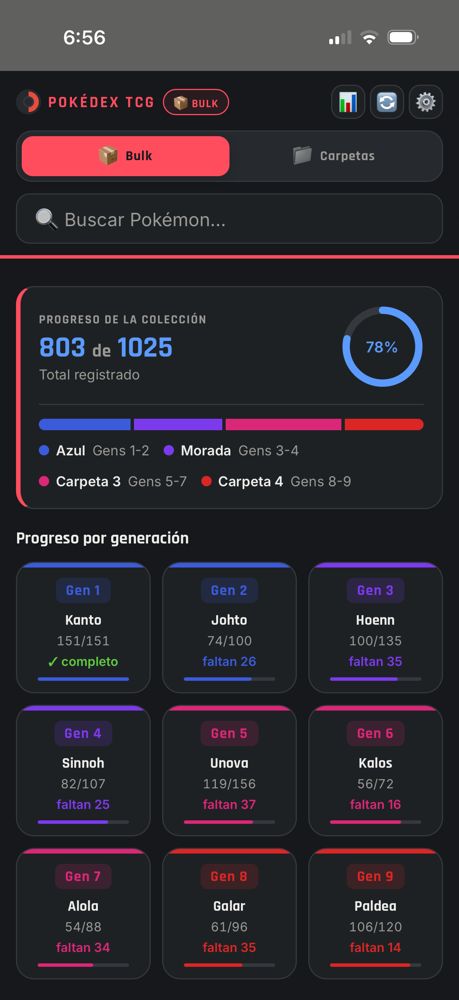
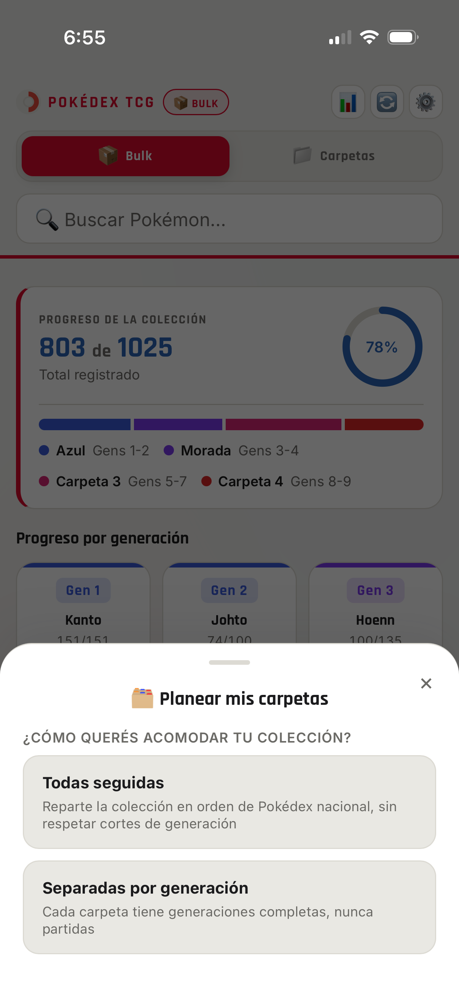
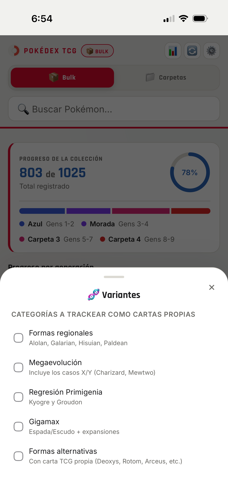
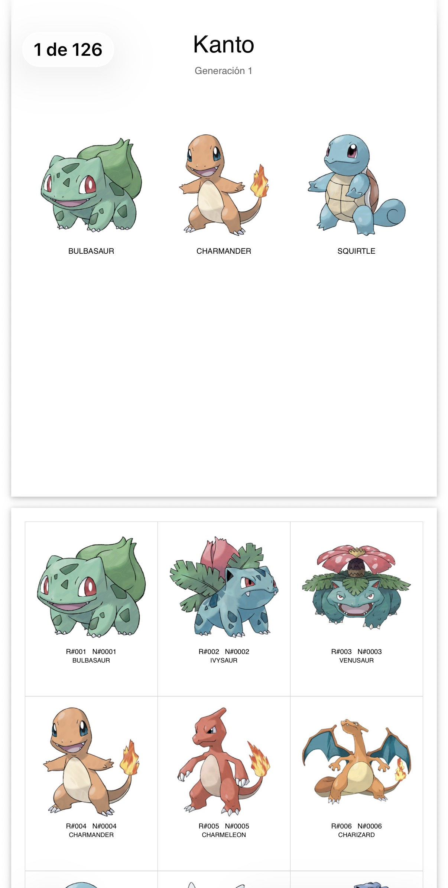

# Pokédex TCG

[Español](README.md) | **English**

Pokédex/TCG personal collection tracker — a self-hosted PWA to track your
card collection, loose or organized into binders.



<table>
<tr>
<td><br><sub>Dark theme</sub></td>
<td><br><sub>Binder wizard</sub></td>
<td><br><sub>Variants (Mega, Gigantamax, etc.)</sub></td>
<td><br><sub>Cutout PDF</sub></td>
</tr>
</table>

## What it does

- **Two independent collection modes**: `bulk` (loose cards, unsorted) and
  `carpetas`/binders (organized into configurable binders — by whole
  generation or by a contiguous Pokédex-number range).
- **Binder setup wizard**: pick how many binders you have, how many pockets
  per sheet your physical binders use, and the app figures out how to split
  the Pokémon between them.
- **Export/import** your whole collection, plus generate **cutout PDFs**
  for the cards you're missing.
- **Optional variants**: Mega Evolution, Gigantamax, regional forms,
  Primal Reversion, and alternate forms — each category toggled
  independently if you count them as cards of their own.
- **Live sync across devices**: mark a card on your phone and it shows up
  instantly on your computer (Server-Sent Events, no polling).
- **Installable as a PWA**, with an offline view of your already-loaded
  collection, and light/dark/auto theme.
- **Spanish / English**, auto-detected from your browser with a manual
  switch in Settings.

## Install with Docker

1. Download this repo's [`docker-compose.yml`](docker-compose.yml) into an
   empty folder.
2. Run:

   ```bash
   docker compose up -d
   ```

3. Open `http://localhost:3000` in your browser — the first time you try
   to make a change (mark a card, set up binders, etc.) it'll ask you to
   set your password right there.

Need a different port because 3000 is already taken? There's no env var
for that on purpose — change the port mapping in `docker-compose.yml`
instead, e.g. `"8080:3000"` instead of `"3000:3000"`.

Your data (collection, binders, backups) is stored in the `./data` folder
next to `docker-compose.yml` — it survives image updates.

### Environment variables

| Variable | Required | Description |
|---|---|---|
| `DATA_DIR` | No | Folder where data is stored. The image already sets it to `/app/data`; no need to touch it unless you know what you're doing. |

You don't need to set a password beforehand: you define it from the app
itself the first time you make a change. If you'd rather set it via
environment variable instead, you can still use `ADMIN_PASSWORD` (see the
comment in `docker-compose.yml`).

### Updating

```bash
docker compose pull
docker compose up -d
```

### Common issues

If `http://localhost:3000` doesn't respond ("connection refused" or
similar), the container might be stuck in a restart loop without `docker
compose up -d` telling you (that command reports success even if the
container is failing). Check:

```bash
docker compose ps
```

If it shows `Restarting` instead of `Up`, see the actual error with:

```bash
docker compose logs
```

## How it's built

Node + Express backend, a single file (`server.js`), no database — the
collection and configuration are stored in JSON files. The frontend is
plain HTML/CSS/JS served as static files (`public/`), no build step, no
framework.

## License

MIT — see [`LICENSE`](LICENSE).
